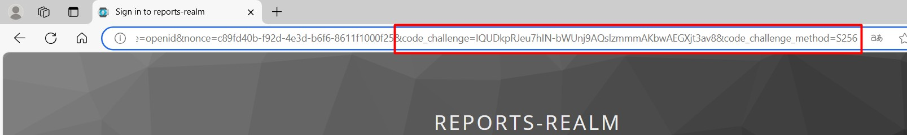
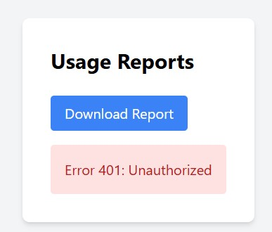
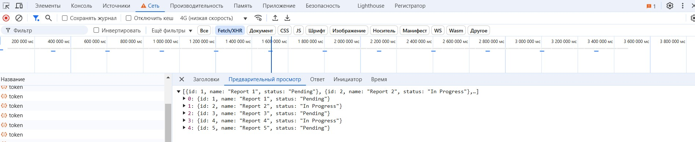

# Reports API

## Описание

Этот проект представляет собой систему, состоящую из фронтенда на React, Keycloak для аутентификации и API на FastAPI. Проект использует аутентификацию с PKCE (Proof Key for Code Exchange). Отдача данных по API c бекенда происходит через валидацию токена и роли пользователя, данные выгружаются только пользователям с ролью **prothetic_user**.

**Репозиторий**: `https://github.com/dv-go/architecture-sprint-8`

## Запуск проекта

Для сборки и запуска проекта используйте Docker Compose:

```
docker-compose up -d --build
```

Убедитесь, что сервисы успешно запустились: keycloak_db, keycloak, frontend, api.

## Описание сервисов

- **Frontend (React)** – предоставляет пользовательский интерфейс для работы с отчётами.  
- **API (FastAPI)** – обрабатывает запросы к эндпоинту `/reports` и проверяет авторизацию пользователей через Keycloak.  
- **Keycloak** – отвечает за аутентификацию и управление пользователями.  
- **Keycloak_db** – база данных сервиса Keycloak.  


## Данные для авторизации

1. Перейдите на страницу фронтенда: [http://localhost:3000/](http://localhost:3000/)
2. Нажмите кнопку **Login** – система перенаправит вас на страницу аутентификации Keycloak (порт 8080).
3. Для входа используйте данные из файла `keycloak/realm-export.json`.


## Проверка реализации PKCE

Проект использует аутентификацию с PKCE (Proof Key for Code Exchange):

- Фронтенд использует PKCE при авторизации через Keycloak.
- Keycloak настроен на обязательное использование PKCE для клиентов.
- При нажатии кнопки **Login** фронтенд перенаправляет пользователя на страницу аутентификации Keycloak. В адресной строке браузера будут присутствовать параметры `code_challenge` и `code_challenge_method`, что подтверждает работу метода PKCE.



## Проверка работы API

1. Перейдите на страницу фронтенда: [http://localhost:3000/](http://localhost:3000/)  
2. Авторизуйтесь, используя один из логинов:  

   **Роль user**  
   - Логин: `user1`  
   - Пароль: `password123`  

   **Роль prothetic_user**  
   - Логин: `prothetic1`  
   - Пароль: `prothetic123`  

3. Нажмите **Download Report**  

### Результаты тестирования  

#### ❌ Тест 1: Вход с ролью `user`
- Ожидаемый результат: **Ошибка 401: Unauthorized**  
- Причина: У пользователя недостаточно прав.  



#### ✅ Тест 2: Вход с ролью `prothetic_user`
- Ожидаемый результат: Файл отчёта успешно скачивается.  
- Подтверждение: В инструментах разработчика браузера видно, что отчёт получен от бекенда.  


